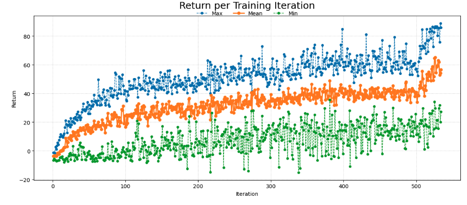

# CarRacing PPO — Reinforcement Learning on Anyscale

Train a PPO agent to drive in [CarRacing-v3](https://gymnasium.farama.org/environments/box2d/car_racing/) using Ray RLlib on Anyscale. This template demonstrates end-to-end RL: hyperparameter search with ASHA, automatic fine-tuning via a training callback, and lightweight evaluation/GIF generation.


## Overview

This template trains a CNN-based PPO agent with a **two-phase approach** in a single script:

| | Phase 1: Explore | Phase 2: Stabilize |
|---|---|---|
| **Iterations** | 0 → 500 | 500 → 1000 |
| **Learning rate** | High (ASHA-selected, ~2e-4) | Low (5e-5) |
| **Entropy coeff** | High (ASHA-selected, ~0.037) | Low (1e-3) |
| **Clip param** | 0.2 | 0.15 |
| **Goal** | Learn fast, explore broadly | Smooth out policy, stop twitching |

The transition happens automatically via an RLlib callback — no manual intervention or second script needed.

## Project Structure

```
├── README.md            # This file
├── requirements.txt     # Python dependencies (gymnasium, pillow, imageio)
├── wrappers.py          # Shared environment wrappers
├── train.py             # Training script (ASHA search + auto fine-tune)
└── evaluate.py          # Generate GIF from a checkpoint (CPU only)
```

## Prerequisites

- An Anyscale workspace with a **GPU worker node** (e.g., 1x T4 or better)
- Ray and PyTorch come pre-installed on Anyscale images
- Install additional dependencies:

```bash
pip install -r requirements.txt
```

## Quick Start

### 1. Train

Run the full pipeline — ASHA hyperparameter search followed by automatic fine-tuning:

```bash
python train.py --max-iters 1000 --finetune-at 500
```

This will:
1. Launch 6 ASHA trials searching over LR, entropy, batch size, minibatch size, and epochs
2. Early-stop bad trials (ASHA grace period = 15 iters, reduction factor = 3)
3. At iteration 500, automatically switch the surviving trial(s) to fine-tuning mode
4. Save checkpoints every 10 iterations and print the best result at the end

**Quick test run** (single trial, no search, finishes in ~30 min):

```bash
python train.py --skip-asha --max-iters 100 --finetune-at 50
```

### 2. Evaluate

Generate a GIF from any checkpoint. This runs on **CPU only** — no GPU or Ray needed, safe to run while training:

```bash
python evaluate.py \
  --checkpoint /path/to/checkpoint \
  --output carracing.gif \
  --episodes 3
```

Run multiple episodes to get a stable reward estimate:

```bash
python evaluate.py --checkpoint /path/to/checkpoint --episodes 10
```

### 3. Plot Training Curve

Generate a training curve plot from the progress CSV (safe to run mid-training):

```bash
python evaluate.py \
  --progress-csv /path/to/progress.csv \
  --plot-output training_curve.png \
  --finetune-at 500
```

Or generate both the GIF and plot in one command:

```bash
python evaluate.py \
  --checkpoint /path/to/checkpoint \
  --progress-csv /path/to/progress.csv \
  --output carracing.gif \
  --plot-output training_curve.png \
  --finetune-at 500 \
  --episodes 3
```



The plot shows min/mean/max episode returns per iteration. The red dashed line marks where the fine-tuning callback kicks in.

## Training Details

### Environment Preprocessing

The raw CarRacing-v3 environment (96×96 RGB, continuous actions) goes through this pipeline:

```
CarRacing-v3 (96×96×3, uint8)
  → FrameSkip(4)              # Repeat actions, sum rewards
  → Grayscale                  # 96×96×1
  → Resize(84×84)             # PIL bilinear interpolation
  → Float [0, 1]              # Normalize pixels
  → RewardScale(0.1)          # Scale rewards for stable gradients
  → FrameStack(4)             # Stack 4 frames
  → StackToChannels           # (84, 84, 4) — ready for CNN
```

### Model Architecture

```
CNN Encoder:
  Conv2d(4, 32, 8×8, stride=4) → ReLU
  Conv2d(32, 64, 4×4, stride=2) → ReLU
  Conv2d(64, 64, 3×3, stride=1) → ReLU
  Flatten → 7744 features

Policy Head:  Linear(7744, 256) → ReLU → Linear(256, 6)  [mean + log_std for 3 actions]
Value Head:   Linear(7744, 256) → ReLU → Linear(256, 1)
```

Separate encoder networks for policy and value (no shared layers).

### Action Space

| Action | Range | Description |
|--------|-------|-------------|
| Steering | [-1, 1] | Left / Right |
| Gas | [0, 1] | Throttle |
| Brake | [0, 1] | Brake |

### ASHA Hyperparameter Search

| Hyperparameter | Search Range |
|---|---|
| Learning rate | loguniform(1e-4, 5e-4) |
| Entropy coefficient | loguniform(5e-3, 5e-2) |
| Batch size per learner | {4096, 8192} |
| Minibatch size | {256, 512} |
| SGD epochs per batch | {6, 10} |

Fixed hyperparameters: γ=0.99, λ=0.95, clip=0.2, vf_loss_coeff=0.5, grad_clip=0.5.

### Fine-Tuning Callback

The `StabilizationCallback` fires once at the configured iteration and patches the live algorithm:
- Unfreezes the learner config, sets new LR/entropy/clip, re-freezes
- Patches optimizer param groups directly
- Clears any LR schedulers to prevent them from overwriting the new LR
- Fixes Adam optimizer state (foreach/tensor bug) if needed

### Expected Results

| Metric | Value |
|---|---|
| Raw reward after Phase 1 (500 iters) | ~470 |
| Raw reward after Phase 2 (1000 iters) | ~600+ |
| Training time (1x T4 GPU, 1000 iters) | ~14 hours |
| Training time (quick test, 100 iters) | ~1.5 hours |

> Note: Rewards shown are raw CarRacing scores. The training logs show **scaled rewards** (÷10) due to `RewardScale(0.1)`. Multiply logged values by 10 to get actual scores.

## CLI Reference

### train.py

```
python train.py [OPTIONS]

Options:
  --max-iters INT          Total training iterations (default: 1000)
  --finetune-at INT        Iteration to switch to fine-tune mode (default: 500)
  --finetune-lr FLOAT      Fine-tune learning rate (default: 5e-5)
  --finetune-entropy FLOAT Fine-tune entropy coefficient (default: 1e-3)
  --finetune-clip FLOAT    Fine-tune PPO clip param (default: 0.15)
  --num-samples INT        Number of ASHA trials (default: 6)
  --skip-asha              Single trial with default hyperparameters
  --results-dir PATH       Where to save checkpoints (default: /mnt/cluster_storage/...)
```

### evaluate.py

```
python evaluate.py [OPTIONS]

Options:
  --checkpoint PATH        Path to RLlib checkpoint (for GIF generation)
  --output PATH            Output GIF path (default: carracing.gif)
  --episodes INT           Number of episodes to run (default: 1)
  --max-steps INT          Max steps per episode (default: 1000)
  --fps INT                GIF frame rate (default: 30)
  --smooth-alpha FLOAT     Action smoothing, 0=off (default: 0.2)
  --steer-deadzone FLOAT   Ignore small steering (default: 0.05)
  --steer-clip FLOAT       Max steering magnitude (default: 0.8)
  --progress-csv PATH      Path to progress.csv for training curve plot
  --plot-output PATH       Output path for plot image (default: training_curve.png)
  --finetune-at INT        Mark fine-tune transition on plot with red line
```

You can use `--checkpoint` and `--progress-csv` independently or together.

## Cluster Requirements

| Component | Spec |
|---|---|
| Head node | CPU only (8 CPU, 32 GB RAM) |
| Worker node | 1× T4 GPU (or better), 8 CPU, 32 GB RAM |
| Env runners | 4 workers × 2 envs each (runs on CPU) |
| Learner | 1 GPU learner |
| Storage | `/mnt/cluster_storage` for checkpoints and logs |

## Troubleshooting

**"beta1 as a Tensor" error when resuming checkpoints**
The training script handles this automatically by converting Adam optimizer state and disabling the `foreach` mode. No action needed.

**GIF generation hangs or is slow**
Use `evaluate.py` (not the full Algorithm). It loads only the model weights on CPU and doesn't need Ray or GPU resources.

**Training reward is low (< 0)**
The first ~50 iterations will show negative rewards as the agent learns basic control. Rewards should turn positive by iteration 50-100 and reach 30+ (scaled) by iteration 200.

**Metrics show `return_mean=None`**
This happens in early iterations when no episodes have completed yet. Returns will appear once full episodes finish (usually by iteration 2-3).
